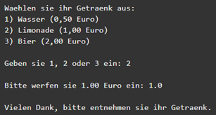

## 02 Verzweigungen

### Aufgabe 1

Die Aufgabe ist, ein Programm zu schreiben, das den BMI (Body-Mass-Index) ausrechnet.
Das Programm nimmt das Gewicht in kg (80kg) und die Körper grösse in m (1.70m) entgegen und berechnet den BMI mit der Formel: 
Körpergewicht geteilt durch Körpergrösse im Quadrat. 
Nun soll das Programm den errechneten BMI zusammen mit der Information, was dies bedeutet zurückgegeben werden.

- Weniger als 18,5: Du hast Untergewicht. 
- Zwischen 18,5 und 24,9: Du hast ein gesundes Normalgewicht. 
- Mehr als 25: Du hast Übergewicht.

Hier ist ein Beispiel: 

Angenommen, du bist 1,70 Meter gross und wiegst 80 Kilogramm.
Dann rechnen: 
- 1,70 x 1,70 = 2,89
- Teile nun das Gewicht durch diesen Wert: 80 : 2,89 = 27,7
- 27,7 – oder aufgerundet 28 – ist der Body-Mass-Index (BMI).

### Aufgabe 2
Die Aufgabe ist es, die Software eines Getränke-Automaten zu schreiben. Der Getränke-Automat hat folgende Funktionalitäten:

- Es gibt mehrere Getränke zur Auswahl: Wasser, Limonade und Bier. 
- Wasser kostet 0.50 CHF, Limonade 1 CHF und Bier 2 CHF. 
- Die Getränke werden jeweils mit nur einem Geldstück bezahlt. 
- Das Festlegen des zu zahlenden Betrages oder das Überprüfen der Zahlung muss mit einer if-else Anweisung erfolgen.

So könnte die Bildschirmausgabe aussehen: 

# BMI-Getr-nke
